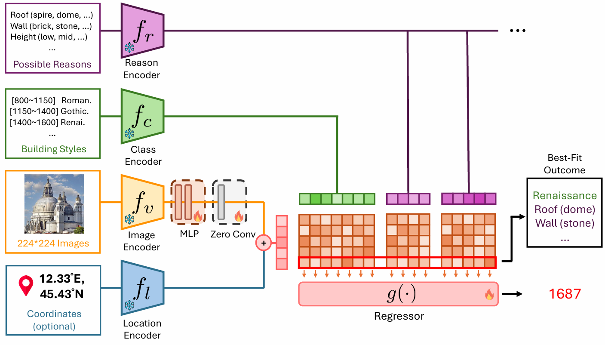

# YearCLIP

Created by Li-Zhong Szu-Tu, Ting-Lin Wu, Chia-Jui Chang, He Syu, [Yu-Lun Liu](https://yulunalexliu.github.io/)

This repository contains PyTorch implementation of YearCLIP in "YearGuessr: A Worldwide Building Age Benchmark with 55k Wikipedia Images and Ordinal Targets".



[Project Page]()
|
[HuggingFace](https://huggingface.co/datasets/Morris0401/Year-Guessr-Dataset)
|
[arXiv]()

## Prerequisite  

### Clone repository

```bash
git clone --recursive https://github.com/Sytwu/Year-Guessr
```

### Dataset

Download links: [\[Google Drive\]](https://drive.google.com/file/d/1qJ-bjiEhjBWcx-ZHyiX3VpDiISLOYNH0/view?usp=sharing)

Download data and save them to `data/` according to the config files.

### Checkpoint

Base weights download links: [[Google Drive]](https://drive.google.com/drive/folders/1pXDa1iLvG_veewtrvpqayOA7mtkUWJYr?usp=sharing)

Download checkpoints (Pytorch/CLIP/Custom) and save them to `.cache/` accordingly.

```
.cache
├── clip
│   ├── RN50.pt
│   └── ViT-B-16.pt
├── resnet
│   └── resnet50_imagenet.pt
└── vgg
    ├── vgg16_imagenet.pt
    └── vgg_imdb_wiki.pt

```

YearCLIP best weights (MAE=39.26) download links: [\[Google Drive\]](https://drive.google.com/file/d/1GSruHHPmyed09isQ2FbGlitDPrsdpPvX/view?usp=sharing)

Download checkpoints and save them to `results/building/` accordingly.

## Installation

### Local Conda Environment
By `.yml` file:

```bash
conda env create -f environment.yml
conda activate yearclip
pip install git+https://github.com/openai/CLIP
pip install -e .
```

## Usage

Directly run the code (train+test):

```bash
python scripts/run.py --config configs/building.yaml
```

Reproduce from ckpt (test):

```bash
python scripts/run.py --config configs/building.yaml --test_only
```

Reproduce YearCLIP best (test):

```bash
python scripts/run.py --config configs/building.yaml --output_dir results/building/YearCLIP_114514 --test_only
```


## Experiments Structure

Each experiment has its own name, with several config component names split by `"_"`.
The experiment folder includes:

- `ckpt/`: checkpoints
- `*_logger/`: the logs from `pytorch_lightning`
- `config.yaml`: config
- `run.log`: log the status of model during running
- `val/test_stats.json`: metrics to be parsed
- `val/val_stats.json`: metrics to be parsed
- `val/ordinality.json`: metrics to be parsed

## Acknowledgement

Many thanks to the following repositories:

- [OrdinalCLIP](https://github.com/xk-huang/OrdinalCLIP), [NumCLIP](https://github.com/xmed-lab/NumCLIP), [GeoCLIP](https://github.com/VicenteVivan/geo-clip/tree/main)

## Citation

If you find this codebase helpful, please consider to cite:

```
@inproceedings{
  szu-tu2025yearguessr,
  title={YearGuessr: A Worldwide Building Age Benchmark with 55k Wikipedia Images and Ordinal Targets},
  author={Li-Zhong Szu-Tu and Ting-Lin Wu and Chia-Jui Chang and He Syu and Yu-Lun Liu},
  booktitle={The 4th DataCV Workshop and Challenge with ICCV2025},
  year={2025},
  url={https://openreview.net/forum?id=ITKg1RQD4q}
}
```
